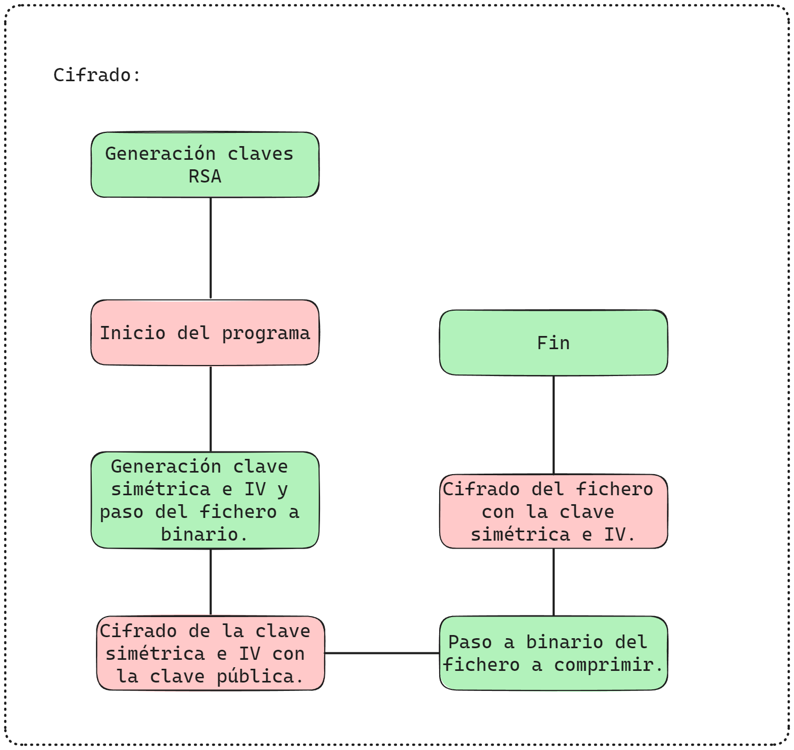
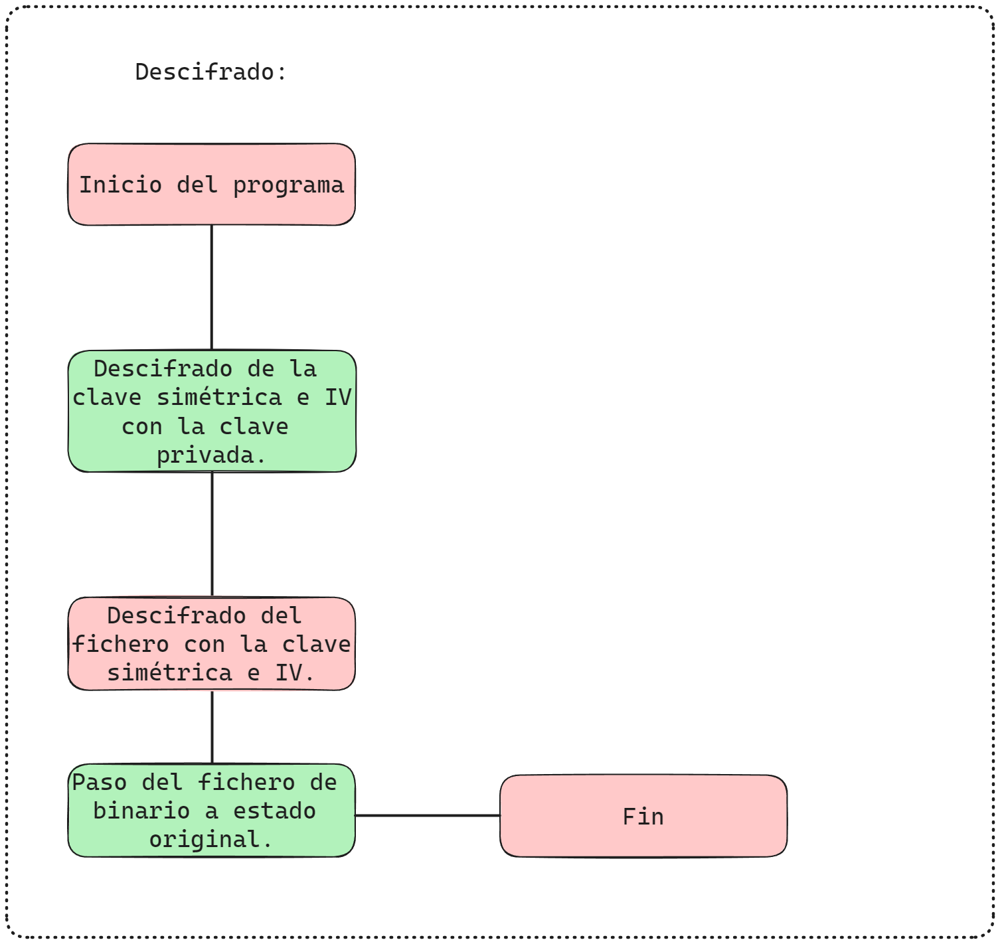

# Cifrador-Descifrador en C:

Este proyecto se encarga de cifrar y descifrar todo tipo de documentos mediante una clave público-privada que cifrará una clave simétrica aleatoria que se encargará de cifrar el resto del documento.

## Diagramas:

### Cifrado:

### Descifrado:


## Puesta a punto:
### Generación de claves:
Es muy importante que estas claves esten siempre localizadas ya que son las llaves maestras para cifrar y descifrar el archivo, en caso de perderlas o ser corruptas los archivos **no** se podrán recuperar.
```bash
openssl genpkey -algorithm RSA -out claveprivada.key -pkeyopt rsa_keygen_bits:4096
openssl rsa -in claveprivada.key -pubout -out clavepublica.pem
``` 
### Instalación de librerías:
```bash
sudo apt install gcc
sudo apt install openssl 
```
### Compilación del código:
```bash
gcc *.c -o ppal -lssl -lcrypto
``` 
### Ejecución:
```bash
./ppal 
# Seguir las instrucciones de la terminal
```
Para más información consultar [Documentación del proyecto](./Documentación.pdf)